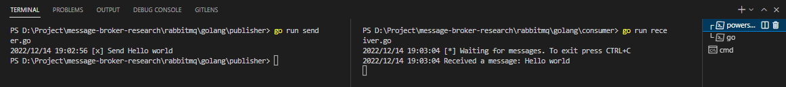
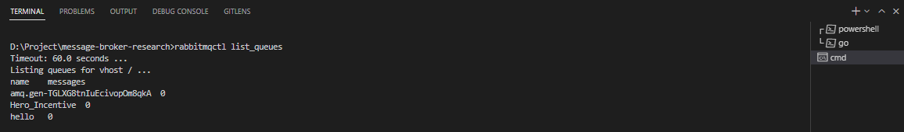

# Simple process messages broker using rabbitMQ and Go-lang
1. Open your the terminal (command line, powershell, etc.)
2. Open the terminal first for run the file `sender.go`
3. Open the terminal second for run the file `receiver.go`
4. Running both file together with running the command in the terminal :
    - fist terminal
    ```go
    go run sender.go
    ```
    
    - second terminal
    ```go
    go run receiver.go
    ```
## Command line result


(**images**: command line when running both file together)  


(**images**: check list queue in rabbitmq)