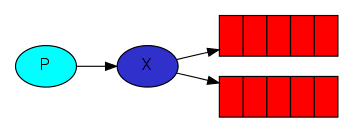
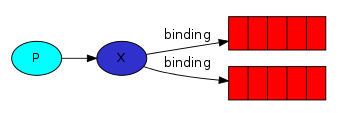
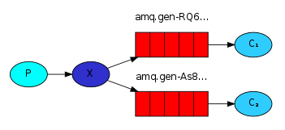

# Publish/Subscribe Pattern in rabbitMQ with Go-lang
To illustrate the pattern, we're going to build a simple logging system. It will consist of two programs -- the first will emit log messages and the second will receive and print them.

- **Exchanges**  
      
    There are a few exchange types available :  
    *`direct`*, *`topic`*, *`headers`*, *`fanout`*  
    for the example we'll focus on the last one -- the *fanout*, Let's create an exchange of this type, and call it `logs`:
    ```go
    err = ch.ExchangeDeclare(
        "logs",   // <--- name
        "fanout", // <--- type
        true,     // durable
        false,    // auto-deleted
        false,    // internal
        false,    // no-wait
        nil,      // arguments
    )
    ```  
    The *fanout* exchange is very simple. As you can probably guess from the name, it just broadcasts all the messages it receives to all the queues it knows. And that's exactly what we need for our logger.  

    Listing exchanges, To list the exchanges on the server you can run this command:
    ```
    rabbitmqctl list_exchanges
    ```
- **Temporary Queues**  
    Giving a queue a name is important when you want to share the queue between producers and consumers. To solve that we need two things.

    **Firstly**, whenever we connect to Rabbit we need a fresh, empty queue.  To do this we could create a queue with a random name, or, even better - let the server choose a random queue name for us.  

    **Secondly**, once we disconnect the consumer the queue should be automatically deleted.
    ```go
    q, err := ch.QueueDeclare(
        "",    // <--- name
        false, // durable
        false, // delete when unused
        true,  // <--- exclusive
        false, // no-wait
        nil,   // arguments
    )
    ```
    When the method returns, the queue instance contains a random queue name generated by RabbitMQ. For example it may look like `amq.gen-JzTY20BRgKO-HjmUJj0wLg`.  
    learn more about the exclusive flag and other queue properties in the  [guide on queues](https://www.rabbitmq.com/queues.html).

- **Bindings**  
      
    That relationship between exchange and a queue is called a binding.  
    ```go 
    err = ch.QueueBind(
        q.Name, // queue name
        "",     // routing key
        "logs", // exchange
        false,
        nil,
    )
    ```  
    Listing bindings, To list the bindings on the server you can run this command:
    ```
    rabbitmqctl list_bindings
    ```

- **Putting it all together**  
      
    If you want to save logs to a file, just open a console and type:  
    `go run receive_logs.go > logs_from_rabbit.log`
    
    If you wish to see the logs on your screen, spawn a new terminal and run:  
    `go run receive_logs.go`
    
    And of course, to emit logs type:  
    `go run emit_log.go`  

    Using *`rabbitmqctl list_bindings`* you can verify that the code actually creates bindings and queues as we want.

