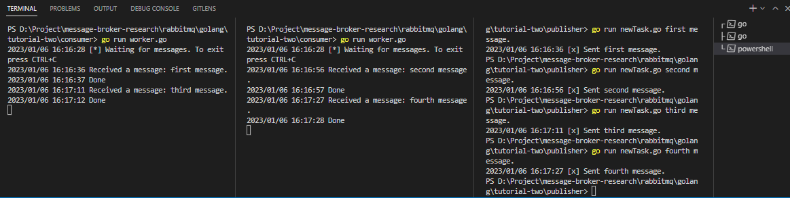

# Simple process work queues using rabbitMQ and Go-lang
Work Queue that will be used to distribute time-consuming tasks among multiple workers.
1. Open your the terminal (command line, powershell, etc.)
2. Installing the package of `amqp` using command  
    ```go
    go get github.com/rabbitmq/amqp091-go
    ```
3. Open the terminal first for run the file `worker.go`
4. Open the terminal second for run the file `newTask.go`
5. Running worker file in both cmd together with running the command in the terminal :
    - first terminal
    ```go
    go run worker.go
    ```
    
    - second terminal
    ```go
    go run worker.go
    ```
6. and the running newTask file with running the command in the terminal : 
    - third terminal
    ```go
    go run newTask.go your_message_in_strings
    ```
    **notes**: in *your_message_in_strings* you can fill with the string message for the example :
    ```go
    go run newTask.go first message
    go run newTask.go second message
    go run newTask.go third message
    go run newTask.go fourth message
    ``` 
## Command line result


(**images**: command line when running worker file and newTask file in cmd)  

**notes**: By default, RabbitMQ will send each message to the next consumer, in sequence. On average every consumer will get the same number of messages. This way of distributing messages is called round-robin. Try this out with three or more workers.